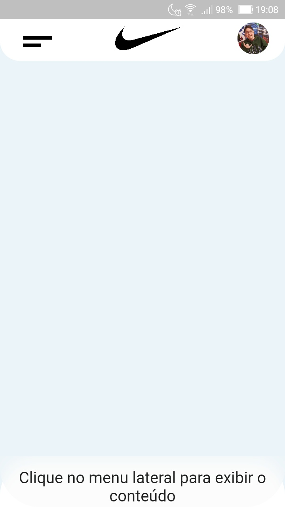
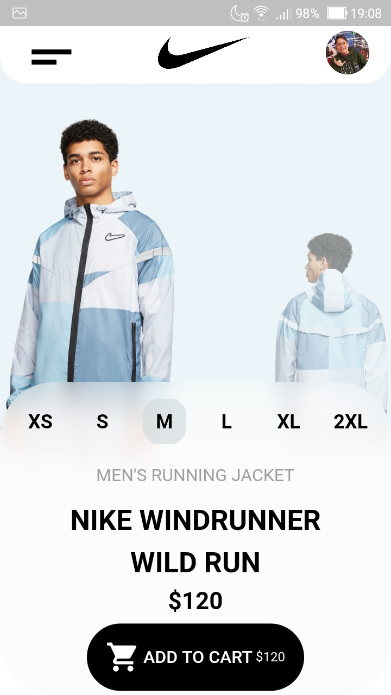
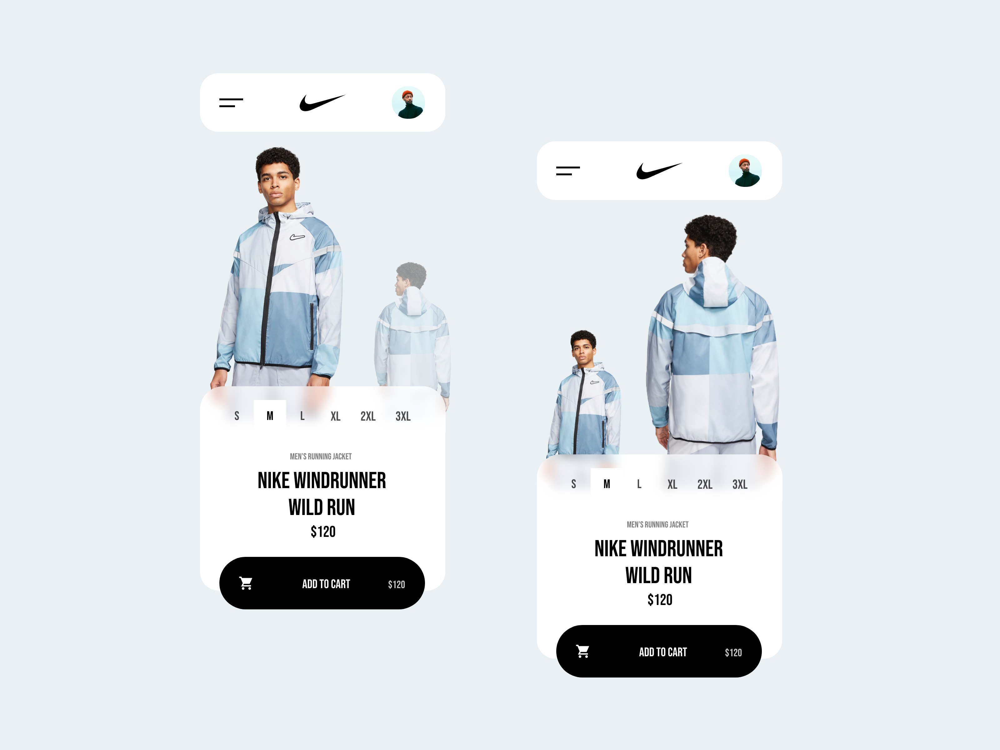

# Nike_Store

A concept app built in Flutterando Challenge using Flutter. This app was made to study design in flutter and implicity animations.

  

_________________________________________________________________________________________________________________________________________

    
     

    
 

_________________________________________________________________________________________________________________________________________

## Getting Started

A few resources to get you started if this is your first Flutter project:

- [Lab: Write your first Flutter app](https://flutter.dev/docs/get-started/codelab)
- [Cookbook: Useful Flutter samples](https://flutter.dev/docs/cookbook)

1. [Install flutter in your machine](https://flutter.dev/docs/get-started/install)
2. Clone this repository in the directory you want
3. Run flutter packages get to update the flutter dependencies
4. Run flutter run to start the application

_________________________________________________________________________________________________________________________________________

## Info

- [Design Mockup](https://dribbble.com/shots/11012468-Nike-Store) by Nicholas.design on dribble
     

- [Flutterando Links](https://linktr.ee/flutterando)

For help getting started with Flutter, view their
[online documentation](https://flutter.dev/docs), which offers tutorials,
samples, guidance on mobile development, and a full API reference.

